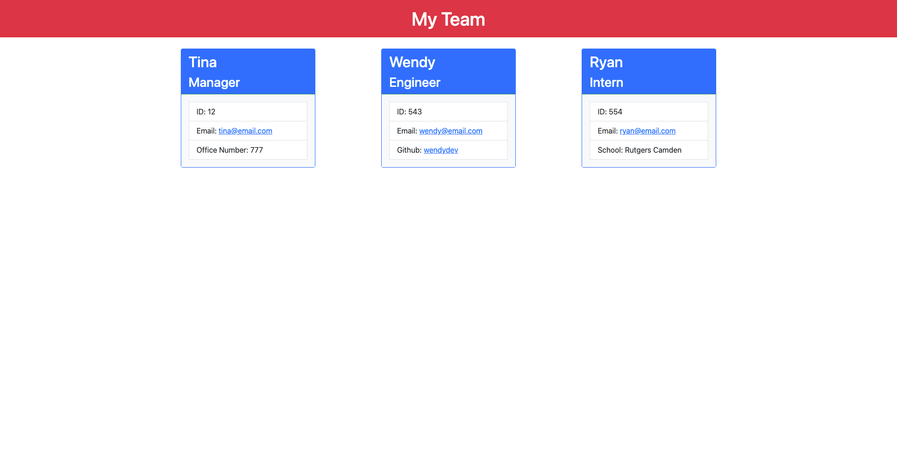

# Team Profile Generator MIT 
  ## Description
  This project was motivated by learning how to use node.js and it's packages inquirer and jest. Team Profile Generator was created to dynamically create and index.html file which dynamically creates cards for employees entered in by the user. The index.html file will display the user's team with respective information of each employee by their role. This generator will help managers and/or business owners organize their employee's information so that it is easily accessible. I learned how to utilize tests for test-driven development.

  ## Table of Contents
  - [Installation](#installation)
  - [Usage](#usage)
  - [Credits](#credits)
  - [License](#license)
  
  ## Installation
  The user must install node.js, npm, inquirer and jest.

  ## Usage
  Run 'node index.js' in your local terminal.
  

  [Link to Video](https://drive.google.com/file/d/15g8fzTyhKxoVs1-rofxSI0967NcJ2n-Y/view?usp=sharing)
  
  ## Credits
  inquirer, jest

  ## License
  

  Copyright 2022 Tina Stanczyk

  Permission is hereby granted, free of charge, to any person obtaining a copy of this software and associated documentation files (the "Software"), to deal in the Software without restriction, including without limitation the rights to use, copy, modify, merge, publish, distribute, sublicense, and/or sell copies of the Software, and to permit persons to whom the Software is furnished to do so, subject to the following conditions:
  
  The above copyright notice and this permission notice shall be included in all copies or substantial portions of the Software.
  
  THE SOFTWARE IS PROVIDED "AS IS", WITHOUT WARRANTY OF ANY KIND, EXPRESS OR IMPLIED, INCLUDING BUT NOT LIMITED TO THE WARRANTIES OF MERCHANTABILITY, FITNESS FOR A PARTICULAR PURPOSE AND NONINFRINGEMENT. IN NO EVENT SHALL THE AUTHORS OR COPYRIGHT HOLDERS BE LIABLE FOR ANY CLAIM, DAMAGES OR OTHER LIABILITY, WHETHER IN AN ACTION OF CONTRACT, TORT OR OTHERWISE, ARISING FROM, OUT OF OR IN CONNECTION WITH THE SOFTWARE OR THE USE OR OTHER DEALINGS IN THE SOFTWARE.
  
  

  https://opensource.org/licenses/MIT

  ## Badges
  Not applicable.

  ## Features
  Not applicable.

  ## How to Contribute
  Invest in me as a developer.

  ## Tests
  Run 'npm run test' in your local terminal.

  ## Questions
  Contact me here if you have further questions: 

  Email - t9.stanczyk@gmail.com 

  Github - https://github.com/tinastanczyk 